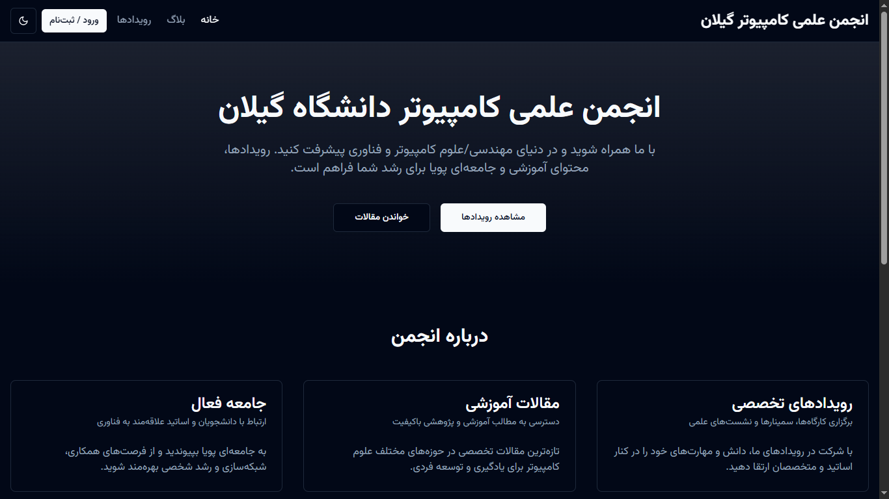
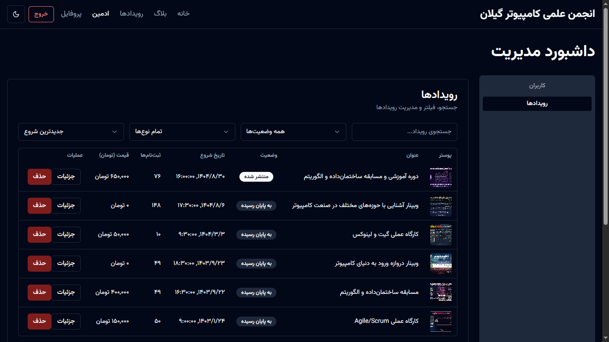

# East Guilan CE

**Full-stack portal** for the East Guilan Computer Engineering Association. The repo hosts a Django/Ninja API backend and a Vite + React + shadcn UI frontend, both orchestrated via Docker Compose.

## Overview
- **Backend**: Django + Ninja-based REST API, PostgreSQL, Redis, Celery, Traefik routing, and Prometheus/metrics.
- **Frontend**: Vite + React 18 with TanStack Query, shadcn/ui components, RTL layout, and staff-only admin tooling.
- **Dev surface**: `docker-compose.yml` brings up Traefik, PostgreSQL, Redis, Django (web/worker/beat), frontend, static/nginx, Prometheus exporters, etc.

## Architecture
1. **API layer (`backend/api`)** exposes auth, blog, event, gallery, payment, and communication routers with Ninja schemas. JWT authentication protects secured routes.
2. **Django apps** (`users`, `blog`, `events`, `payments`, `gallery`, etc.) provide models, management commands, and async tasks/Celery workers.
3. **Frontend** (`frontend/`) consumes the API, handles login flows, event listings, the admin dashboard, rich markdown rendering, and sonner toasts.

## Getting started
1. Copy `.env.example` to `.env` and configure secrets.
2. `docker compose up --build` to start the full stack.
3. Backend tests: `docker compose exec backend python manage.py test --settings=config.settings.test`.
4. Frontend dev: `docker compose exec frontend npm run dev -- --host`.

## Screenshots

See the [`backend/README.md`](backend/README.md) and [`frontend/README.md`](frontend/README.md) for detailed instructions.
